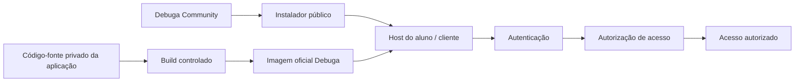
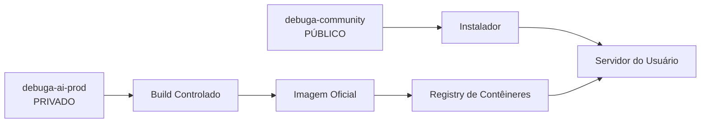
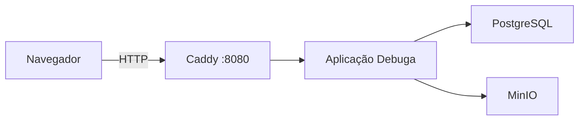
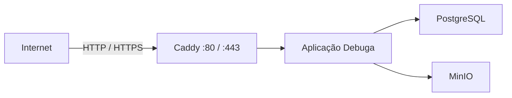
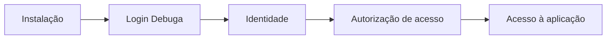
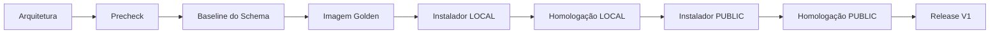

<div align="center">

# Debuga Community

### Infraestrutura simples. Implantação reproduzível. Acesso autenticado.

**Instalador · Documentação · Comunidade · OpenInfra**

[](#status-do-projeto)
[](#instalador-v1)
[](#plataforma-homologada)
[](#arquitetura)
[](SECURITY.md)

---

### Distribuição pública. Uso autenticado.

O **Debuga Community** é a camada pública de distribuição, documentação e
colaboração do ecossistema Debuga.

O código-fonte principal da aplicação permanece privado e controlado.

O termo **Community** identifica o repositório público de distribuição,
documentação e colaboração do ecossistema Debuga. Não representa, por si
só, uma edição funcionalmente limitada da aplicação.

</div>

---

## Visão Geral

O `debuga-community` foi criado para tornar a implantação do Debuga mais
simples, reproduzível e acessível para alunos, laboratórios, clientes e
profissionais de infraestrutura.

O objetivo é permitir que uma instalação seja realizada sem exigir:

- acesso ao repositório privado da aplicação;
- compilação local;
- `npm install`;
- `pnpm build`;
- ferramentas de desenvolvimento;
- conhecimento avançado de Docker;
- configuração manual de TLS no modo PUBLIC;
- credenciais internas da Sperry Tecnologia.

O instalador e a documentação do Debuga são públicos. Alunos OpenInfra
autenticados têm acesso integral ao ambiente e aos recursos disponibilizados
para sua formação. Clientes e demais usuários acessam o Debuga conforme a
autorização vinculada à sua conta.

A experiência desejada é:

```text
VM ou VPS limpa
      │
      ▼
Instalador Debuga
      │
      ▼
Validação automática
      │
      ▼
Stack versionada
      │
      ▼
Debuga disponível
      │
      ▼
Autenticação
      │
      ▼
Autorização de acesso
      │
      ▼
Acesso autorizado
```

---

## Arquitetura



### Separação de responsabilidades

| Camada | Visibilidade | Responsabilidade |
|---|---|---|
| Código da aplicação | Privado | Produto e desenvolvimento |
| Build oficial | Controlado | Produção da imagem homologada |
| Imagem Debuga | Versionada | Artefato executável |
| Debuga Community | Público | Instalador, documentação, templates e manifests |
| Autenticação | Controlado | Identidade do usuário |
| Autorização de acesso | Controlado | Autorização de uso |

> Tornar o instalador público não significa liberar o produto para uso
> sem autenticação.

---

## Modelo de Distribuição



O servidor final não precisa receber o código-fonte proprietário.

O fluxo é baseado em artefatos versionados e rastreáveis.

---

## Instalador V1

O Instalador V1 está sendo projetado para perguntar ao usuário apenas o
estritamente necessário.

### Modo LOCAL

Indicado para:

- cursos;
- laboratórios;
- redes internas;
- homologação;
- ambientes sem domínio público.



Características:

- acesso por `http://IP:8080`;
- sem domínio obrigatório;
- sem TLS;
- sem Certbot;
- sem Nginx Proxy Manager;
- sem pfSense obrigatório;
- banco de dados não publicado no host;
- MinIO não publicado no host.

---

### Modo PUBLIC

Indicado para:

- VPS;
- servidor publicado diretamente na Internet;
- ambiente com domínio próprio.



Características:

- domínio obrigatório;
- HTTPS automático;
- Caddy como único proprietário do TLS;
- portas `80` e `443`;
- PostgreSQL e MinIO isolados na rede interna.

---

## Stack V1

A instalação padrão pretende utilizar uma stack pequena e previsível:

| Componente | Papel |
|---|---|
| Aplicação Debuga | Aplicação |
| PostgreSQL 16 | Banco de dados |
| MinIO | Armazenamento de objetos |
| Caddy | Gateway HTTP / HTTPS |

### Não faz parte da instalação padrão V1

- Ollama;
- GPU;
- Nginx Proxy Manager;
- pfSense;
- Certbot manual;
- Node.js para build;
- Git para baixar código da aplicação.

Recursos de IA local poderão aparecer futuramente como módulos opcionais.

---

## Autenticação e Autorização de Acesso

Princípio fundamental:

> **PUBLICAR NÃO É AUTORIZAR USO**

O repositório público distribui documentação e mecanismos de instalação.

O uso da aplicação continua associado a uma identidade autorizada.



O instalador público nunca deve conter:

- senha compartilhada;
- token GitHub pessoal;
- token GHCR embutido;
- API key da Sperry;
- credencial de aluno;
- credencial de cliente;
- segredo de operador.

Distribuição e autorização permanecem separadas.

---

## Alunos OpenInfra

O aluno OpenInfra autorizado e autenticado possui acesso integral ao
ambiente e aos recursos disponibilizados para sua formação.

O Debuga Community foi projetado para também suportar o ecossistema de
aprendizado e homologação OpenInfra.

```text
OpenInfra
    │
    ▼
Aluno / Profissional
    │
    ▼
Debuga Community
    │
    ▼
Instalador
    │
    ▼
VM / VPS
    │
    ▼
Debuga
```

A meta é tornar infraestrutura inteligente reproduzível sem transformar o
processo de instalação em uma barreira de entrada.

---

## Plataforma Homologada

O primeiro alvo oficial do Instalador V1 é:

| Requisito | V1 |
|---|---|
| Sistema | Ubuntu Server 22.04 LTS |
| Arquitetura | x86_64 |
| CPU | 2+ vCPU recomendado |
| RAM | 4 GB recomendado |
| Disco | 20+ GB livres recomendado |
| Runtime | Docker Engine |
| Gateway | Caddy |
| Banco | PostgreSQL 16 |
| Armazenamento | MinIO |

### Futuras homologações

Ainda não devem ser consideradas oficialmente suportadas:

- Ubuntu 24.04;
- ARM64;
- outras distribuições Linux.

---

## Integridade de Releases

Cada release oficial deverá possuir rastreabilidade.

```text
Versão do Instalador
       │
       ▼
Versão do Debuga
       │
       ▼
Digest da Imagem
       │
       ▼
Versão do Schema
       │
       ▼
Data da Release
```

O modelo final utilizará:

- tags versionadas;
- digest SHA-256;
- checksums de artefatos públicos;
- manifesto de release;
- schema versionado.

---

## Baseline Homologada da Aplicação (Golden Application Baseline)

O Instalador V1 não tem como objetivo redesenhar ou modificar a aplicação.

A primeira release deverá preservar o comportamento funcional validado da
aplicação de referência.

Isso inclui, entre outros:

- landing page;
- autenticação;
- navegação;
- APIs;
- comportamento funcional;
- integrações existentes aprovadas.

O trabalho do Instalador é alterar **como o produto é implantado**, não
reescrever o produto.

---

## Escopo Público

Conteúdo que poderá existir neste repositório:

- Instalador V1;
- prechecks públicos;
- documentação;
- templates;
- exemplos;
- troubleshooting;
- manifests;
- checksums;
- scripts operacionais aprovados;
- integrações;
- documentação OpenInfra;
- recursos comunitários.

---

## Fronteira Privada

Não pertence ao `debuga-community`:

- código-fonte proprietário da aplicação;
- conteúdo do `debuga-ai-prod`;
- arquivos `.env`;
- secrets;
- API keys;
- credenciais;
- tokens;
- banco de produção;
- dumps;
- evidências da Phase 2;
- auditorias internas;
- configuração específica de clientes;
- chaves privadas;
- material interno de infraestrutura.

---

## Estrutura do Repositório

A estrutura crescerá somente conforme existirem artefatos reais.

```text
debuga-community/
│
├── README.md
├── SECURITY.md
├── CONTRIBUTING.md
├── CODE_OF_CONDUCT.md
│
├── docs/
│   └── architecture/
│       └── OVERVIEW.md
│
├── installer/               # somente após homologação
│
├── examples/                # quando disponíveis
│
├── releases/
│   └── manifests/           # releases oficiais
│
└── .github/
    ├── ISSUE_TEMPLATE/
    └── workflows/
```

Não serão criados diretórios vazios apenas para aparentar maturidade.

---

## Segurança

Segurança faz parte da arquitetura do projeto.

Antes de contribuir ou publicar material, leia:

**[SECURITY.md](SECURITY.md)**

Nunca publique:

- credenciais;
- tokens;
- chaves privadas;
- banco de dados;
- dumps;
- evidências internas;
- dados de clientes;
- configuração sensível.

---

## Contribuindo

O Debuga Community poderá receber contribuições em:

- documentação;
- traduções;
- templates;
- troubleshooting;
- monitoramento;
- backups;
- exemplos;
- integrações;
- melhorias no instalador público.

Veja:

**[CONTRIBUTING.md](CONTRIBUTING.md)**

O núcleo proprietário da aplicação segue processo separado.

---

## Status do Projeto

| Fase | Estado |
|---|---|
| Arquitetura do Instalador V1 | ✅ Concluída |
| Precheck em VM limpa | ✅ Aprovado |
| Baseline canônico do banco | 🚧 Em andamento |
| Imagem Docker Golden | ⏳ Pendente |
| Instalador LOCAL | ⏳ Pendente |
| Homologação LOCAL | ⏳ Pendente |
| Instalador PUBLIC | ⏳ Pendente |
| Homologação PUBLIC | ⏳ Pendente |
| Release V1.0.0 | ⏳ Pendente |

Executáveis públicos somente serão disponibilizados após homologação.

---

## Roadmap



---

## Licenciamento

A política de licenciamento dos componentes públicos ainda está sendo
definida.

A visibilidade pública deste repositório **não constitui automaticamente uma
licença open source**.

Nenhuma licença deve ser presumida até que um artefato possua declaração
explícita.

---

<div align="center">

## Debuga Community

**Infraestrutura reproduzível. Distribuição controlada. Acesso autenticado.**

Mantido por **Sperry Tecnologia**

</div>
