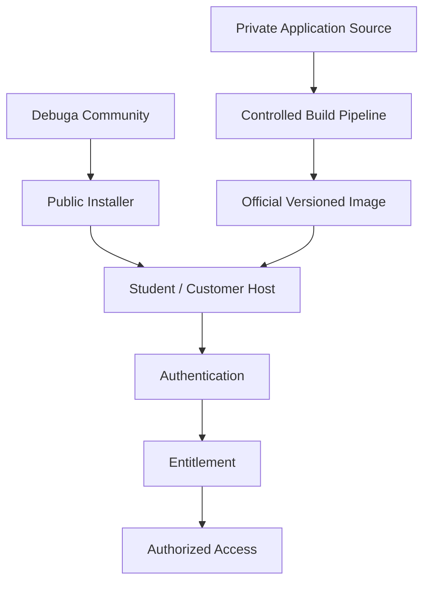
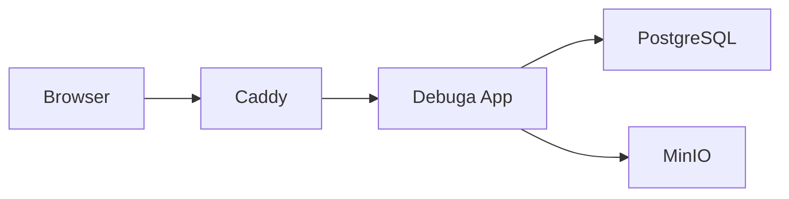

# Debuga Community Architecture

## Objetivo

O Debuga Community fornece a camada pública de distribuição do ecossistema
Debuga preservando uma fronteira explícita entre recursos públicos de
implantação e o código privado da aplicação.

## Distribution Boundary



## Runtime Padrão



## LOCAL

```text
Browser → HTTP :8080 → Caddy → Debuga App
```

Indicado para laboratório, curso, homologação e rede interna.

## PUBLIC

```text
Internet → HTTP/HTTPS :80/:443 → Caddy → Debuga App
```

Indicado para VPS ou servidor publicado diretamente.

## Princípio de Segurança

```text
Public Distribution
        ≠
Authorized Use
```

Disponibilizar recursos de instalação publicamente não remove os requisitos
de autenticação e entitlement do produto.

## Princípio de Release

```text
Source
  ↓
Controlled Build
  ↓
Immutable Image
  ↓
Release Manifest
  ↓
Installer
  ↓
Validated Deployment
```

Cada componente público deve ser rastreável e verificável antes de uma
release oficial.
