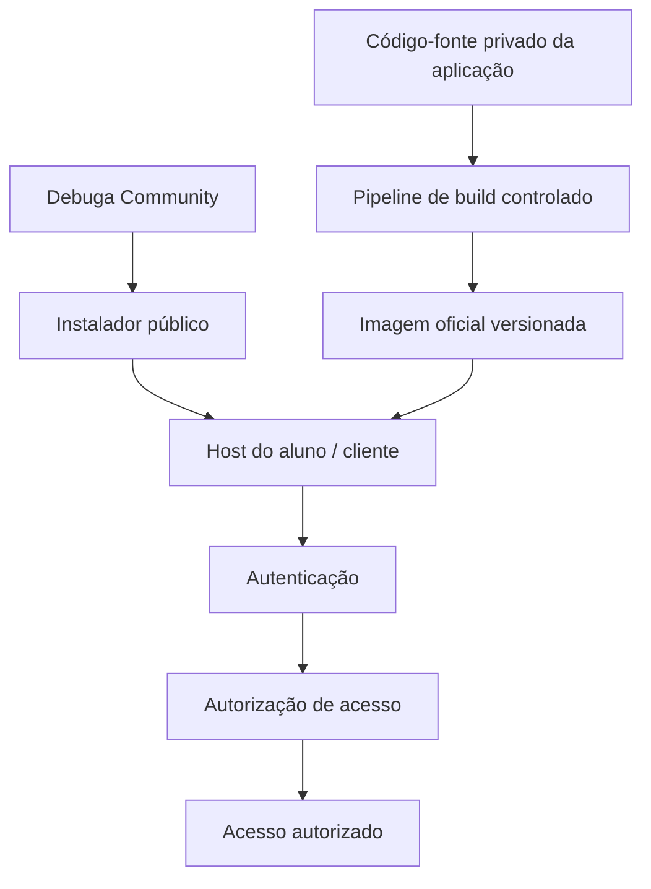
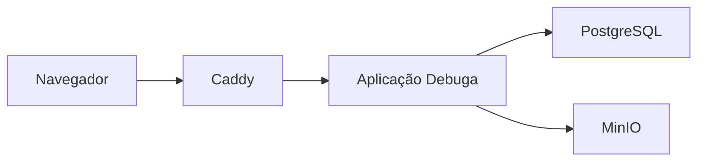

# Arquitetura do Debuga Community

## Objetivo

O Debuga Community fornece a camada pública de distribuição do ecossistema
Debuga preservando uma fronteira explícita entre recursos públicos de
implantação e o código privado da aplicação.

O termo **Community** identifica o repositório público de distribuição,
documentação e colaboração do ecossistema Debuga. Não representa, por si
só, uma edição funcionalmente limitada da aplicação.

## Fronteira de Distribuição



## Runtime Padrão



## Modo LOCAL

```text
Navegador → HTTP :8080 → Caddy → Aplicação Debuga
```

Indicado para laboratório, curso, homologação e rede interna.

## Modo PUBLIC

```text
Internet → HTTP/HTTPS :80/:443 → Caddy → Aplicação Debuga
```

Indicado para VPS ou servidor publicado diretamente.

## Princípio de Segurança

```text
Distribuição pública
        ≠
Uso autorizado
```

Disponibilizar recursos de instalação publicamente não remove os requisitos
de autenticação e autorização de acesso do produto.

## Alunos OpenInfra

Alunos OpenInfra autorizados e autenticados possuem acesso integral ao
ambiente e aos recursos disponibilizados para sua formação.

## Princípio de Release

```text
Código-fonte
    ↓
Build controlado
    ↓
Imagem imutável
    ↓
Manifesto de release
    ↓
Instalador
    ↓
Implantação validada
```

Cada componente público deve ser rastreável e verificável antes de uma
release oficial.
