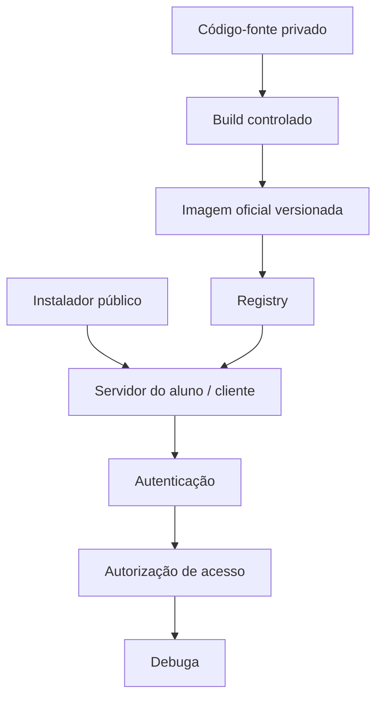
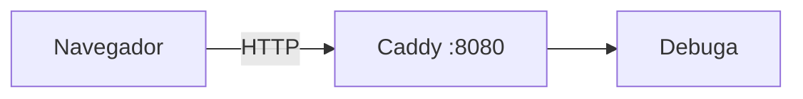
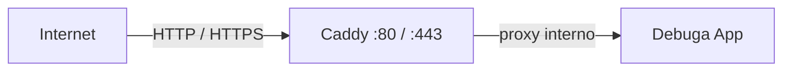

# Especificação Arquitetural do Repositório — Debuga Community

**Documento:** `docs/architecture/REPOSITORY-SPEC.md`
**Repositório:** SperryTecnologia/debuga-community
**Idioma principal:** PT-BR
**Status:** Especificação pública — reflete o estado real do projeto

---

## Índice

1. [Propósito](#1-propósito)
2. [Modelo de Acesso](#2-modelo-de-acesso)
3. [Fronteira Público / Privado](#3-fronteira-público--privado)
4. [Modelo de Distribuição](#4-modelo-de-distribuição)
5. [Modos de Implantação](#5-modos-de-implantação)
6. [Stack V1](#6-stack-v1)
7. [Releases](#7-releases)
8. [Registry e Credenciais](#8-registry-e-credenciais)
9. [Banco de Dados](#9-banco-de-dados)
10. [Baseline da Aplicação](#10-baseline-da-aplicação)
11. [Segurança](#11-segurança)
12. [Governança Git](#12-governança-git)
13. [Idioma e Qualidade Documental](#13-idioma-e-qualidade-documental)
14. [Estado de Implementação](#14-estado-de-implementação)

---

## 1. Propósito

O Debuga Community é o hub público de distribuição, documentação e
colaboração do ecossistema Debuga. Ele concentra o Instalador, a
documentação, os templates, os exemplos, os manifests, os checksums, o
troubleshooting e os recursos da comunidade, incluindo os recursos para
alunos OpenInfra.

O repositório **não contém o código-fonte principal da aplicação Debuga**.

O termo Community identifica o repositório público de distribuição,
documentação e colaboração do ecossistema Debuga. Não representa, por si
só, uma edição funcionalmente limitada da aplicação.

---

## 2. Modelo de Acesso

O princípio aprovado que rege todo o acesso é:

> **Distribuição pública. Uso autenticado.**

Publicar o Instalador e a documentação não autoriza uso anônimo do produto.
O acesso ao Debuga sempre passa por identidade e autorização.

```text
Instalador público
        │
        ▼
Instalação
        │
        ▼
Autenticação
        │
        ▼
Autorização de acesso
        │
        ▼
Acesso ao Debuga
```

### Alunos OpenInfra

Aluno OpenInfra autorizado e autenticado possui acesso integral ao ambiente
e aos recursos disponibilizados para sua formação.

O acesso integral ao ambiente de formação continua condicionado à
autenticação e à autorização vinculada ao aluno. A instalação, por si só,
não concede acesso ao produto.

---

## 3. Fronteira Público / Privado

### Conteúdo público

Pertence ao debuga-community:

| Categoria | Exemplos |
|---|---|
| Instalador | Instalador V1, prechecks |
| Documentação | README, especificações, troubleshooting |
| Templates | Exemplos de implantação e configuração |
| Manifests | Manifestos de release |
| Checksums | Verificação de integridade de artefatos |
| Recursos comunitários | Contribuições, integrações, documentação OpenInfra |

### Conteúdo privado

Permanece fora do repositório público:

| Categoria | Exemplos |
|---|---|
| Código-fonte proprietário | Aplicação Debuga (repositório privado da aplicação) |
| Secrets | Tokens, chaves de API, chaves privadas |
| Credenciais | Arquivos `.env` reais, credenciais de registry, chaves privadas |
| Dados operacionais | Dumps de banco, evidências de produção |
| Auditorias internas | Evidências de auditoria, Phase 2 |
| Dados de clientes | Configurações e dados específicos de clientes |

A fronteira é conceitual e permanente: o repositório público nunca deverá
receber material privado, mesmo em revisões de histórico.

---

## 4. Modelo de Distribuição

O servidor final do aluno ou cliente não precisa acessar o código-fonte
privado, executar build ou compilar a aplicação. O fluxo é baseado em
artefatos versionados e rastreáveis.



O aluno não precisa:

- acessar o código-fonte privado;
- executar build;
- usar npm / pnpm para compilar a aplicação;
- receber credenciais da Sperry.

---

## 5. Modos de Implantação

Os modos abaixo documentam o estado **planejado / em homologação** do
Instalador V1.

### Modo LOCAL



Indicado para alunos, laboratórios, redes internas e homologação. Sem
domínio obrigatório, sem TLS.

### Modo PUBLIC



Indicado para VPS e servidor publicado diretamente. Domínio obrigatório e
HTTPS automático na borda, com o Caddy como proprietário único do TLS.

O Caddy termina o TLS e encaminha internamente as requisições para o
Debuga App. O HTTPS interno entre Caddy e Debuga não é definido no modo
padrão.

### Modo EDGE (futuro)

Um modo avançado de borda poderá ser considerado futuramente. Está
registrado apenas como possibilidade **FUTURO** e não é um modo suportado
na versão V1.

---

## 6. Stack V1

A stack pretendida da instalação V1:

| Componente | Papel |
|---|---|
| Debuga App | Aplicação |
| PostgreSQL 16 | Banco de dados |
| MinIO | Armazenamento de objetos |
| Caddy | Gateway HTTP / HTTPS |

Não faz parte do padrão V1 inicial:

- Ollama;
- GPU;
- Nginx Proxy Manager;
- pfSense obrigatório;
- Certbot manual;
- build Node.js no host final.

Recursos de IA local poderão aparecer futuramente como módulos opcionais.

---

## 7. Releases

### Modelo conceitual

```text
Versão do Instalador
        │
        ▼
Versão do Debuga
        │
        ▼
Digest da imagem
        │
        ▼
Versão do schema
        │
        ▼
Data da release
```

### Artefatos futuros

- release manifest;
- checksums SHA-256;
- imagem distribuída por tag + digest;
- releases rastreáveis e verificáveis.

### Estado

O modelo de releases está **FUTURO**. Não há ainda digest publicado,
imagem oficial distribuída, versão final ou schema homologado neste
repositório. Nenhuma release foi executada até o momento.

---

## 8. Registry e Credenciais

Regra definitiva:

> O Instalador público **nunca** contém: PAT; token GHCR; usuário/senha de
> registry; credencial compartilhada; segredo do operador; API key da
> Sperry.

Se futuramente existir distribuição privada de imagem, ela exigirá um
mecanismo próprio de distribuição autenticada. Esse mecanismo **não está
definido agora** e não deve ser presumido.

---

## 9. Banco de Dados

A instalação V1 utilizará um baseline canônico versionado do schema do
banco, atualmente nomeado conceitualmente como:

```text
schema-baseline-v1
```

O baseline está **EM HOMOLOGAÇÃO**.

O conceito público é o de um schema de referência validado sobre o qual
apenas migrations futuras versionadas serão aplicadas. Detalhes internos,
mecanismos de reconciliação e qualquer evidência de auditoria pertencem à
fronteira privada e não são publicados neste repositório.

---

## 10. Baseline da Aplicação

O objetivo do Instalador é alterar **COMO o Debuga é implantado**, não
alterar **O QUE o Debuga é**.

A versão de referência é a:

**Baseline Homologada da Aplicação (Golden Application Baseline)**

O comportamento preservado inclui, conceitualmente:

- landing;
- autenticação;
- navegação;
- APIs;
- comportamento funcional;
- integrações aprovadas.

---

## 11. Segurança

### Segredos no repositório

Nunca publicar neste repositório:

- secrets, credenciais, tokens, private keys;
- arquivos `.env` reais;
- dumps de banco;
- evidências de auditoria;
- dados ou configurações específicas de clientes.

### Incidente de segredo publicado

Em um incidente de segredo publicado, o processo conceitual é:

1. considerar o segredo comprometido;
2. revogar ou rotacionar imediatamente;
3. interromper a distribuição do artefato afetado;
4. revisar o histórico do repositório;
5. seguir processo controlado de remediação;
6. revisar sistemas dependentes.

A remediação detalhada de histórico é um processo operacional interno e
não deve ser prescrita nesta documentação arquitetural.

### Autenticação

A autenticação permanece responsabilidade da camada da aplicação. O
Instalador não implementa usuários padrão, senhas compartilhadas, bypasses
ou tokens globais.

---

## 12. Governança Git

A branch `main` representa o conteúdo aprovado.

### Fluxo de mudanças

```text
main
    │
    ▼
branch de trabalho
    │
    ▼
validação
    │
    ▼
Pull Request
    │
    ▼
revisão
    │
    ▼
merge autorizado
```

### Regras

- não realizar alterações diretamente em `main`;
- não realizar force push;
- não reescrever o histórico arbitrariamente;
- não criar Releases sem autorização;
- não publicar pacotes ou imagens sem autorização;
- commits devem seguir Conventional Commits quando aplicável e não devem
  agrupar alterações sem relação.

---

## 13. Idioma e Qualidade Documental

O idioma principal da documentação pública é o **PT-BR**.

Nomes próprios e tecnologias mantêm sua forma oficial:

> Debuga Community · OpenInfra · Docker · Caddy · PostgreSQL · MinIO ·
> GitHub · OAuth · API · SHA-256 · TLS · HTTP · HTTPS · LOCAL · PUBLIC

A documentação pública deve ser:

- profissional e clara;
- previsível em sua estrutura, com índices e seções claras;
- enriquecida com diagramas Mermaid quando agregarem valor;
- econômica no uso de tabelas (apenas quando úteis);
- livre de marketing exagerado;
- livre de informação interna desnecessária;
- honesta quanto ao estado de cada recurso (ATUAL / EM HOMOLOGAÇÃO /
  FUTURO).

Um recurso planejado nunca deve ser representado como pronto.

---

## 14. Estado de Implementação

| Componente | Estado |
|---|---|
| Repositório público | ATUAL |
| Documentação pública | ATUAL |
| Especificação deste documento | ATUAL |
| Arquitetura do Instalador V1 | ATUAL |
| Precheck de host | ATUAL |
| Modos LOCAL / PUBLIC | EM HOMOLOGAÇÃO |
| Baseline do schema (`schema-baseline-v1`) | EM HOMOLOGAÇÃO |
| Baseline Homologada da Aplicação | ATUAL (aplicação de referência validada) |
| Imagem oficial Debuga | FUTURO |
| Instalador V1 executável | FUTURO |
| Modelo de releases | FUTURO |
| Modo EDGE | FUTURO (possibilidade avançada) |

---

*Documento mantido por Sperry Tecnologia. Para a visão geral resumida da
arquitetura, consulte [OVERVIEW.md](OVERVIEW.md).*
